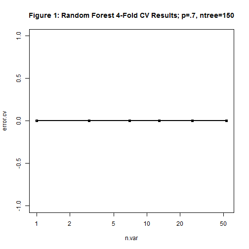

**Problem:** One thing that people regularly do is to quantify how much of a particular activity they do, but they rarely quantify how well they do it. This project tries to quantify, or should I say classify, how well people do the activity of weight lifting. In essence, this is a machine learning classification problem (prediction of a discrete outcome), not a machine learning regression problem (prediction of a continuous outcome).

Six young health participants were asked to perform one set of 10 repetitions of the Unilateral Dumbbell Biceps Curl in five different fashions:     

1. exactly according to the specification (Class A)
2. throwing the elbows to the front (Class B)
3. lifting the dumbbell only halfway (Class C)
4. lowering the dumbbell only halfway (Class D)
5. throwing the hips to the front (Class E).

Class A corresponds to the specified execution of the exercise; the other 4 classes correspond to common mistakes. 

**Project Goal:** To use data from the accelerometers on the belt, forearm, arm, and dumbbell of the 6 partipants to build an optimal model that predicts the classification
(A-E) of how well the participants lift weights.

**Project Stategy:** Build the model using the standard model building methodology

**Project Tactics:** Execute the strategy by answering the following questions: 1. How I built the model? 2. How I used cross validation? 3. What do I think the expected error is? and 4. Why I made the choices I did? 

**1. How I built the model -** I used the standard model building methodology workflow:

**Question  ->  Input Data  ->  Features  ->  Algorithm  ->  Parameters  ->  Evaluation**

**--Question:** Out of five different ways, how did the participants lift the barbells?

**--Input Data:** After loading the requisite libraries and setting the seed, I read in the data which consisted of 19,622 cases and 160 variables per case. A summary of these data revealed a lot of variables with NAs or invalid values (e.g., DIV/0!). However, my first step was to remove the near zero variance variables. After this process, 124 variables remained. The next step was to remove the NAs but I reserved the right to impute these values if this step had any negative impact on the prediction model. After this process, only 59 variables remained and none of the variables had invalid values (i.e, the DIV/0! had been removed) Lastly, I removed the irrelevant variables, variables 1 - 6: X, raw_timestamp_part_1, raw_timestamp_part_2, cvtd_timestamp, and num_window.


```r
# Load libraries, data, and set seed

## Load Libaries


suppressPackageStartupMessages(library(caret))
suppressPackageStartupMessages(library(ggplot2)) 
suppressPackageStartupMessages(library(randomForest))

## Set Seed

set.seed(9854)


## Get Raw Data

rawtrainData <- read.csv(file="training.csv", na.strings=c("NA", "#DIV/0!"))
rawtestData <- read.csv(file="testing.csv", na.string=c("NA", "#DIV/0!"))

set.seed(3333)

#  Clean Raw Data
#summary(rawtrainData)
#summary(rawtestData)

# Remove Near Zero Variance Variables

nsvIndex <- nearZeroVar(rawtrainData[, -(length(rawtrainData))]) #C/O saveMetric=T parameter
vartrainData <- rawtrainData[,-nsvIndex]
vartestData <- rawtestData[,-nsvIndex]

# Remove NAs or Impute New Values

trainNAs <- apply(vartrainData, 2, function(x) {sum(is.na(x))})
testNAs <- apply(vartestData, 2, function(x) {sum(is.na(x))})


noNAsTrain <- vartrainData[, which(trainNAs==0)]
noNAsTest <- vartestData[, which(testNAs==0)] 
```


**--Features:** The following 52 variables were used as my feature set to build a model to predict classe.


```r
# Get Feature Variables

featureSetMD <- colnames(noNAsTrain[, -(1:6)])
modelData <- noNAsTrain[featureSetMD]
featureSetTD <- colnames(noNAsTest[, -(1:6)])
testData <-  noNAsTest[featureSetTD]
```


```r
featureSetMD[-53]
```

```
##  [1] "roll_belt"            "pitch_belt"           "yaw_belt"            
##  [4] "total_accel_belt"     "gyros_belt_x"         "gyros_belt_y"        
##  [7] "gyros_belt_z"         "accel_belt_x"         "accel_belt_y"        
## [10] "accel_belt_z"         "magnet_belt_x"        "magnet_belt_y"       
## [13] "magnet_belt_z"        "roll_arm"             "pitch_arm"           
## [16] "yaw_arm"              "total_accel_arm"      "gyros_arm_x"         
## [19] "gyros_arm_y"          "gyros_arm_z"          "accel_arm_x"         
## [22] "accel_arm_y"          "accel_arm_z"          "magnet_arm_x"        
## [25] "magnet_arm_y"         "magnet_arm_z"         "roll_dumbbell"       
## [28] "pitch_dumbbell"       "yaw_dumbbell"         "total_accel_dumbbell"
## [31] "gyros_dumbbell_x"     "gyros_dumbbell_y"     "gyros_dumbbell_z"    
## [34] "accel_dumbbell_x"     "accel_dumbbell_y"     "accel_dumbbell_z"    
## [37] "magnet_dumbbell_x"    "magnet_dumbbell_y"    "magnet_dumbbell_z"   
## [40] "roll_forearm"         "pitch_forearm"        "yaw_forearm"         
## [43] "total_accel_forearm"  "gyros_forearm_x"      "gyros_forearm_y"     
## [46] "gyros_forearm_z"      "accel_forearm_x"      "accel_forearm_y"     
## [49] "accel_forearm_z"      "magnet_forearm_x"     "magnet_forearm_y"    
## [52] "magnet_forearm_z"
```
Although I used all the above features to build my model, only 7 are required to build an optimal model: a model with an accuracy rate of approximately 99%. Using the **importance** function in conjunction with the **randomForest** function discussed in the next section, the requisite varibles of importance to build this model were identified and are listed in their order of importance below:

1. roll_ belt -- variable # 1     
2. yaw_belt -- variable # 3    
3. magnet_dumbbell_z -- variable # 39    
4. pitch_forearm -- variable # 41    
5. pitch_belt -- variable # 2    
6. magnet_dumbbell_y -- variable # 38    
7. roll-forearm -- variable # 40    


**--Algorithm:** Using the classe variable as the outcome and the 52 features as the predictors, I fitted various models using two librarys, two prediction functions and three methods:

1. library(caret); function train, method=rpart (Trees Method)   
2. library(caret; function train, method=rf (Random Forest Method)   
3. library(caret); function train, method=gbm (Generalized Boosting Method)
4. library(RandomForest), function randomForest (Random Forest Method)

My selection criteria were speed and accuracy. My strategy for testing the models was simple: used the least amount of data to fit or train the model and test it on the greatest amount of data available. Therefore, I initially set p=.10. The rpart (trees) results were completely different from the other models, so I eliminated it. The results of the gbm (boosting) method indicated that 150 was the optimal number for the ntree parameter. So I set p=.2 and ntree=150 and repeated the process. The rf method was too time consuming, so I eliminated it. I set p=.3 and ntree=150 and repeated the process. The predictions from the gbm model and the randomForest model  were the same but the gbm model took much more time than the randomForest model, so I eliminated it and selected the randomForest model because of both speed and accuracy. Another reason I selected this model is because I could use a random forest cross validation function (rfcv) to validation a random forest model's predictions.


**--Parameters:** The parameters used in the final model are:

* p=.70 (set in the createDataPartition Function)     
* ntree=150 not the 500 default value (set in randomForest Function)     
* mytry=default value  ("not" set in randomForest Function)    

Seventy percent of training data proved to be the most optimal; that is, when set lower than 70%, the error rate was higher. The ntree parameter was set at 150 because the test results from the boosting model indicated this number to be the most optimal. I tested this number to make certain this was indeed the most optimal and the final test results proved this to be correct. Please note that the p and ntree parameters were the most sensitive. That is, if either one was set below the prescribed values, the error rate of the predictions increased. In contrast, if these parameters were set equal to the prescribed values, it made no difference what value mytry was set to (e.g., 10 or 20). Therefore, I used the default value for the mytry parameter.

**--Evaluation:** To test the robustness of the accuracy of the final random forest model's predictions, I manipulated both of the sensitive parameters: ntree and p. The results are shown in the Accuracy Tables below (see discussion on the expected error). The optimal level is when ntree=150 and p=.70. When these parameter are set at other values, there appears to be diminishing returns in the prediction accuracy rates. For instance, when p=.7 and ntree=500, (the default setting), the accuracy rate of Class D declines from .9915 to .9910. Also, when ntree=100, Class A has a higher accuracy rate at p=.60 (.9974) then at p=.70 (.9968).


**2. How I used cross validation -** I used the random forest cross validation function **"rfcv"** to perform a 4-fold cross validation on the predictions of my random forest model. I set the parameter ntree=150 and initially set p=.10 and increased it by .10 until it was equal to .70. At each iteration, I observed a graph of the error rate and when p was equal to .70, the error rate was virtually equal to zero as shown in Figure 1.


```r
# Create Training and Test Sets

set.seed(1791)
inTrain <- createDataPartition(y=modelData$classe,
                               p=.7, list=FALSE)
training <-modelData[inTrain,]
testing <-modelData[-inTrain,] # To be used for Cross Validation

#dim(training); dim(testing)

# Train the Model : Fit The Model using various Methods 

## Note the Random Forest Package needs to be Installed before executing the next command.
## Note Fitting the Model Consumes Time (i.e., it takes a lot of time)

set.seed(1300)
# modFit <- train(classe ~.,
#                 method="rf", 
#                 prox=T,
#                 ntree=150, 
#                 mytry=10, 
#                 data=training)
 modFit <- randomForest(classe ~., 
                        ntree=150, 
#                        mytry=10, #not needed because same results with or without
                        data=training)
# modFit <- train(classe ~.,
#                 method="gbm", 
#                 verbose=F, 
#                 data=training)

# modFit <- train(classe ~.,
#                 method="rpart", 
#                 data=training)

# Note the model uses all the other variables to predict the classification of classe 

# Print the Results

#print(modFit)


# Test the Model: Predict new values 

#pred <- predict(modFit, testing); testing$predRight <- pred==testing$classe # use for graph

# Look at the Accuracy of the Predictions

# Cross-Validate the Model Method 1

#set.seed(8103)
#predTrain <- predict(modFit, newdata=training)
#print(confusionMatrix(predTrain, training$classe))

#predTest <- predict(modFit, newdata=testing)
#print(confusionMatrix(predTest, testing$classe))

# Cross-Validate the Model Method 2

set.seed(6478)
result <- rfcv(testing, testing$classe, cv.fold=4)
with(result, plot(n.var, error.cv, log="x", type="o", lwd=2,
                  main= "Figure 1: Random Forest 4-Fold CV Results; p=.7, ntree=150"))
```

 

**3. What I think the expected error is -** I think the overall out-of-sample expected error rate is slightly higher than the biased in-sample expected error rate, but virtually zero (i.e., 0.0061 vs 0.0055, respectively). Based on the Accuracy Tables below, the out-of-sample expected error rate (1 - the accuracy rate) is virtually zero at p=.70 and ntree=150 across all classes. This expected error rate is also depicted in Figure 1 above. Also note that Class D has the highest error rate (or lowest accuracy rate). 

##### Accuracy Tables (Source: Confusion Matrix from the Testing/Out of Sampling Data)   

**ntree=100|Class A|Class B|Class C|Class D|Class E**    
  p=.50 |.9968       |.9880      |.9884      |.9872      |.9977         
  p=.60 |.9974       |.9928      |.9942      |.9918      |.9958      
  p=.70 |.9968       |.9880      |.9884      |.9872      |.9977
   
**ntree=150 |Class A |Class B|Class C|Class D|Class E**    
   p=.50|.9964       |.9884      |.9891      |.9869      |.9974          
   p=.60|.9975       |.9950      |.9950      |.9926      |.9960      
   p=.70|.9992       |.9972      |.9937      |.9915      |.9971  


**ntree=500|Class A|Class B|Class C|Class D|Class E**     
   p=.50|.9969       |.9890      |.9898      |.9866      |.9974          
   p=.60|.9974       |.9935      |.9946      |.9923      |.9960      
   p=.70|.9992       |.9972      |.9936      |.9910      |.9971     
                      

**4. Why I made the choices I did -** I chose the randomForest model because I was looking for optimal speed and accuracy; it provided both. And because of consistency, I also chose a random forest cross validation function to evaluate a random forest model's predictions; which turned out to be perfect -- 20 for 20 or a "zero" error rate, as the cross validation graph depicted.    

####  Predictions

```r
predAnswers <- predict(modFit, newdata=testData)
predAnswers
```

```
##  1  2  3  4  5  6  7  8  9 10 11 12 13 14 15 16 17 18 19 20 
##  B  A  B  A  A  E  D  B  A  A  B  C  B  A  E  E  A  B  B  B 
## Levels: A B C D E
```
#### Reference

Velloso, E.; Bulling, A.; Gellersen, H.; Ugulino, W.; Fuks, H. Qualitative Activity Recognition of Weight Lifting Exercises. Proceedings of 4th International Conference in Cooperation with SIGCHI (Augmented Human '13) . Stuttgart, Germany: ACM SIGCHI, 2013. 


